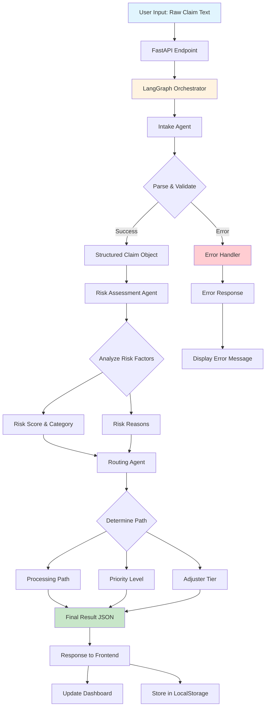

# FNOL Multi-Agent Insight Board

A sophisticated First Notice of Loss (FNOL) processing system built with LangGraph multi-agent orchestration, featuring automated claim intake, risk assessment, and routing decisions with a modern React-based dashboard.

## 🏗️ Architecture Overview

```
┌─────────────────────────────────────────────────────────────────┐
│                    FNOL INSIGHT BOARD                           │
├─────────────────────────────────────────────────────────────────┤
│                                                                 │
│  ┌─────────────────┐    API    ┌──────────────────────────┐    │
│  │   React UI      │◄─────────►│     FastAPI Backend      │    │
│  │   Dashboard     │           │                          │    │
│  │                 │           │  ┌─────────────────────┐ │    │
│  │ • Claim Form    │           │  │  LangGraph         │ │    │
│  │ • Processing    │           │  │  Orchestrator      │ │    │
│  │ • Results View  │           │  │                    │ │    │
│  │ • System Logs   │           │  │  ┌─────────────┐   │ │    │
│  └─────────────────┘           │  │  │   Intake    │   │ │    │
│                                 │  │  │   Agent     │   │ │    │
│                                 │  │  └─────────────┘   │ │    │
│                                 │  │         │          │ │    │
│                                 │  │         ▼          │ │    │
│                                 │  │  ┌─────────────┐   │ │    │
│                                 │  │  │    Risk     │   │ │    │
│                                 │  │  │  Assessment │   │ │    │
│                                 │  │  │   Agent     │   │ │    │
│                                 │  │  └─────────────┘   │ │    │
│                                 │  │         │          │ │    │
│                                 │  │         ▼          │ │    │
│                                 │  │  ┌─────────────┐   │ │    │
│                                 │  │  │  Routing    │   │ │    │
│                                 │  │  │   Agent     │   │ │    │
│                                 │  │  └─────────────┘   │ │    │
│                                 │  └─────────────────────┘ │    │
│                                 └──────────────────────────┘    │
└─────────────────────────────────────────────────────────────────┘
```

## 🔄 Agent Interaction Flow



## 🎯 Orchestration Strategy

### Sequential Processing Pipeline
The system employs a **sequential multi-agent architecture** where each agent specializes in a specific domain:

1. **Intake Agent** (First Stage)
   - **Purpose**: Parse unstructured claim text into structured data
   - **Technology**: LangChain + Pydantic output parsers
   - **Tools**: `parse_claim_text`, `validate_claim_json`
   - **Output**: Structured claim object with all required fields

2. **Risk Assessment Agent** (Second Stage)
   - **Purpose**: Evaluate claim risk based on multiple factors
   - **Technology**: LangChain ReAct agent with custom tools
   - **Tools**: `calculate_risk_score`, `categorize_risk`, `generate_risk_reasons`
   - **Input**: Structured claim from Intake Agent
   - **Output**: Risk score (0-10), category (Low/Medium/High), and reasoning

3. **Routing Agent** (Third Stage)
   - **Purpose**: Determine optimal processing path and resource allocation
   - **Technology**: LangChain ReAct agent with decision tools
   - **Tools**: `determine_processing_path`, `assign_priority`, `select_adjuster_tier`
   - **Input**: Risk report from Risk Assessment Agent
   - **Output**: Processing path, priority level, and adjuster assignment

### State Management
- **LangGraph StateGraph**: Manages workflow state across agents
- **Type Safety**: TypedDict enforces data contracts between agents
- **Error Handling**: Graceful failure with detailed error propagation
- **Logging**: Comprehensive audit trail of all agent actions

### Orchestration Benefits
- **Modularity**: Each agent can be developed and tested independently
- **Scalability**: Easy to add new agents or modify existing ones
- **Reliability**: Sequential processing ensures data consistency
- **Transparency**: Full audit trail of decisions and reasoning
- **Flexibility**: Agents can be bypassed or modified based on conditions

## 🚀 Quick Start

### Prerequisites
- Python 3.11+
- Node.js 18+
- OpenAI API Key

### Backend Setup

1. **Clone and navigate to backend**
   ```bash
   git clone <repository-url>
   cd fnol-insight-board/Backend
   ```

2. **Create virtual environment**
   ```bash
   python -m venv venv
   
   # Windows
   venv\Scripts\activate
   
   # macOS/Linux
   source venv/bin/activate
   ```

3. **Install dependencies**
   ```bash
   pip install fastapi uvicorn langchain langchain-openai langgraph python-dotenv
   ```

4. **Configure environment**
   ```bash
   # Create .env file in Backend directory
   echo "OPENAI_API_KEY=your_openai_api_key_here" > .env
   ```

5. **Start the backend server**
   ```bash
   uvicorn main:app --reload --host 0.0.0.0 --port 8000
   ```

   Backend will be available at: `http://localhost:8000`

### Frontend Setup

1. **Navigate to frontend directory**
   ```bash
   cd ../Frontend/fnol-flow-vision
   ```

2. **Install dependencies**
   ```bash
   npm install
   ```

3. **Start development server**
   ```bash
   npm run dev
   ```

   Frontend will be available at: `http://localhost:8081` (or another port if 8081 is busy)

## 📁 Project Structure

```
fnol-insight-board/
├── Backend/
│   ├── main.py                 # FastAPI application entry point
│   ├── models.py              # Pydantic models and schemas
│   ├── requirements.txt       # Python dependencies
│   ├── .env                   # Environment variables (create this)
│   └── Agents/
│       ├── orchestrator.py    # LangGraph orchestration logic
│       ├── intake_graph.py    # Intake agent implementation
│       ├── risk_agent.py      # Risk assessment agent
│       └── routing_agent.py   # Routing decision agent
├── Frontend/
│   └── fnol-flow-vision/
│       ├── package.json       # Node.js dependencies
│       ├── vite.config.ts     # Vite configuration
│       ├── src/
│       │   ├── components/    # React components
│       │   ├── contexts/      # React Context providers
│       │   ├── services/      # API services
│       │   ├── pages/         # Route components
│       │   └── types/         # TypeScript definitions
│       └── public/            # Static assets
└── README.MD                  # This file
```

## 🔌 API Endpoints

### Backend API (Port 8000)

| Endpoint | Method | Description |
|----------|---------|-------------|
| `/` | GET | Health check and API info |
| `/actual_claim` | POST | Process claim through agent pipeline |
| `/test/status` | GET | View internal agent state (debug) |

### Example API Usage

```bash
# Health check
curl http://localhost:8000/

# Process a claim
curl -X POST http://localhost:8000/actual_claim \
  -H "Content-Type: application/json" \
  -d '"Customer CUST-001 reported auto collision incident. Policy number POL-12345. Estimated loss $5000. Incident occurred on 2024-01-15 at Main St intersection. No police report filed. Minor injuries reported. Description: Rear-ended at traffic light during rush hour. Submitted on 2024-01-15T10:30:00Z."'
```

## 🎨 Frontend Features

- **📝 Claim Submission**: Rich form with validation for claim details
- **📊 Real-time Dashboard**: Live processing logs and system metrics
- **📈 Risk Visualization**: Visual risk assessment with color-coded indicators
- **🔍 Claim Details**: Comprehensive view of processed claims
- **💾 Data Persistence**: LocalStorage integration for claim history
- **🔄 Live Updates**: Real-time processing status and agent logs
- **📱 Responsive Design**: Works on desktop, tablet, and mobile

## 🛠️ Development

### Running in Development Mode

**Terminal 1 - Backend:**
```bash
cd Backend
uvicorn main:app --reload --host 0.0.0.0 --port 8000
```

**Terminal 2 - Frontend:**
```bash
cd Frontend/fnol-flow-vision
npm run dev
```

### Building for Production

**Backend:**
```bash
cd Backend
pip install -r requirements.txt
uvicorn main:app --host 0.0.0.0 --port 8000
```

**Frontend:**
```bash
cd Frontend/fnol-flow-vision
npm run build
npm run preview
```

## 🔧 Configuration

### Environment Variables

Create a `.env` file in the `Backend` directory:

```env
# Required
OPENAI_API_KEY=your_openai_api_key_here

# Optional
LANGCHAIN_TRACING_V2=true
LANGCHAIN_API_KEY=your_langsmith_api_key
LANGCHAIN_PROJECT=fnol-insight-board
```

### Customization

- **Agent Prompts**: Modify agent prompts in respective agent files
- **Risk Factors**: Adjust risk calculation logic in `risk_agent.py`
- **Routing Rules**: Customize routing decisions in `routing_agent.py`
- **UI Theme**: Edit Tailwind configuration in `tailwind.config.ts`

## 📚 Technology Stack

### Backend
- **FastAPI**: Modern Python web framework
- **LangChain**: LLM application framework
- **LangGraph**: Multi-agent orchestration
- **OpenAI GPT-4**: Language model for intelligent processing
- **Pydantic**: Data validation and serialization
- **Uvicorn**: ASGI server

### Frontend
- **React 18**: Modern React with hooks
- **TypeScript**: Type-safe JavaScript
- **Vite**: Fast build tool and dev server
- **Tailwind CSS**: Utility-first CSS framework
- **Shadcn/ui**: High-quality React components
- **React Router**: Client-side routing
- **Lucide React**: Beautiful icons

## 🐛 Troubleshooting

### Common Issues

1. **Backend won't start**
   - Check OpenAI API key in `.env` file
   - Ensure Python virtual environment is activated
   - Verify all dependencies are installed

2. **Frontend won't connect to backend**
   - Confirm backend is running on port 8000
   - Check CORS configuration in `main.py`
   - Verify API base URL in `services/api.ts`

3. **Claims not processing**
   - Check browser console for JavaScript errors
   - Verify OpenAI API key has sufficient credits
   - Review backend logs for agent errors

### Debug Tools

- **Backend Logs**: Check `agent.logs` and `sent.logs` files
- **Frontend Console**: Browser dev tools for client-side issues
- **Agent Status**: Visit `/test/status` endpoint for internal state
- **Health Check**: Visit `/` endpoint to verify backend connectivity

## 📄 License

This project is licensed under the MIT License - see the LICENSE file for details.

## 🤝 Contributing

1. Fork the repository
2. Create a feature branch (`git checkout -b feature/amazing-feature`)
3. Commit your changes (`git commit -m 'Add amazing feature'`)
4. Push to the branch (`git push origin feature/amazing-feature`)
5. Open a Pull Request

## 📞 Support

For questions and support, please open an issue in the GitHub repository.

---

**Built with ❤️ using LangGraph Multi-Agent Architecture**
